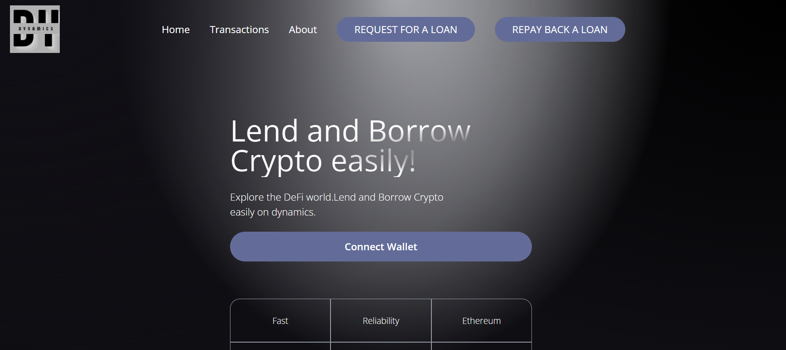

# DYNAMICS
## Lending and saving DApp built on ethereun using solidity and react.
 

## Project Description  

This DApp is used to borrow and lend cryptocurrencies for a short time, 
the frontend is built in a way to make sure anyone can use the product for fast loans. 
 Borrowers would be able to deposit collateral and request for loans easily, they can pay in installments and withdraw their collateral after
repayment is made.

Lenders can also invest there crypto, then request for interest easily. There is also a feature where lenders can get there interest even if the borrower defaults on
payment
  

## Project Snapshot  
    

## Project Website Link  

https://dynamics-bxqt.vercel.app/ 
  

## Acknowledgments  

<li>Milen Radkov - milenradkov@me.com </li>
<li>https://www.jsmastery.pro/ </li>   

## Project Author  

Ayoola Victor - ayoolavictor415@gmail.com 
  

## How to install/ Run the product  

1. Navigate to the client folder and install the needed dependencies using npm start  

2. Navigate the smart contract folder, compile and deploy the smart contracts using hardhat compile 

3. Deploy contracts using npx hardhar run scripts/deploy.js --network goerli 

4. Navigate back to the client app and use npm run dev to run the react app 

5. Make sure you get an Api key from Alchemy or Quicknode and also input a contract address in the hardhat.config.js file 
  

## License  

 MIT 

 GRANDIDA 

